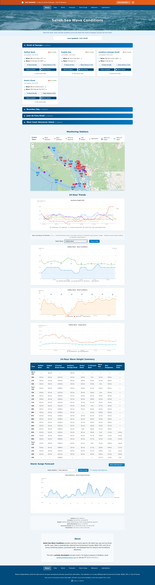

---

# 🌊 Salish Sea Wave Conditions Monitor

A real-time, open-source wave and weather monitoring system for the **Salish Sea** region — combining data from Environment Canada and NOAA buoys.

📍 **Live demo:** [halibutbank.ca](https://halibutbank.ca)
🔗 **Front-end repo:** [surf-website-front-end](https://github.com/Keelando/surf-website-front-end)
🧭 **Region:** Strait of Georgia, English Bay, Neah Bay, and surrounding waters
⚙️ **Stack:** Python · SQLite · Vanilla JS · HTMX · CSS · ECharts



---

## Overview

This system collects, processes, and displays marine weather data from:
- **9 Wave Buoys** – Halibut Bank, English Bay, Southern Georgia Strait, Sentry Shoal (EC), Neah Bay, New Dungeness, Angeles Point, Cherry Point, Smith Island (NOAA)
- **13 Wind Stations** – Point Atkinson, Sisters Island, Entrance Island, Ballenas, Sand Heads, Tsawwassen, Saturna, Race Rocks, YVR, Boundary Bay (EC), Jericho (JSCA), Bellingham, Orcas Island (US)
- **12 Tide Stations** – Point Atkinson, Kitsilano, Tsawwassen, White Rock, Crescent Beach, New Westminster, Campbell River, Nanaimo, Tofino, Ucluelet, Port Renfrew, Victoria Harbor (DFO IWLS)
- **23 Lightstations** – Chrome Island, Merry Island, Sisters Island, Race Rocks, Cape Scott, Quatsino, Nootka, Estevan Point, Lennard Island, Cape Beale, and 13 more (DFO)
- **3 Webcams** – White Rock Pier, White Rock East Beach, Cox Bay (10-minute snapshots with 30-day archive)

### Key Features
- 🔁 Automated XML + text feed collection
- 💾 SQLite database for local persistence (auto schema management)
- 🧩 JSON exports for static website rendering
- 📊 24-hour interactive charts with vanilla JS (ECharts)
- 🎨 Modern, responsive UI with HTMX and CSS
- 🌊 Real-time tide predictions and observations
- 🌊 Storm surge forecasts (GeoMet GDSPS) with combined water level modeling
- 🌊 Observed storm surge calculation (tide offset analysis)
- ⚙️ Smart deduplication and update scheduling
- 🌊 NOAA "swell vs wind wave" separation
- 📸 Webcam archival system (30-day rolling archive)
- 🏗️ Lightstation weather reports (manual + automated parsing)  

---

## 📍 Monitored Stations

### Wave Buoys (9)

**Environment Canada:**
- `4600146` – Halibut Bank (off Vancouver)
- `4600303` – Southern Georgia Strait
- `4600304` – English Bay (Vancouver Harbor)
- `4600131` – Sentry Shoal (Northern Strait of Georgia)

**NOAA NDBC:**
- `46087` – Neah Bay (includes spectral wave data: swell vs wind waves)
- `46088` – New Dungeness / Hein Bank

**Additional NOAA:**
- `46267` – Angeles Point
- `CPMW1` – Cherry Point, WA (C-MAN land station, also in wind database)
- `SISW1` – Smith Island, WA (C-MAN land station, also in wind database)

### Wind Stations (13)

**Environment Canada SWOB-ML weather stations:**
- `CWGT` – Sisters Islets (Strait of Georgia)
- `CWGB` – Ballenas (Strait of Georgia)
- `CWEL` – Entrance Island (Nanaimo area)
- `CWSB` – Point Atkinson (West Vancouver)
- `CVTF` – Tsawwassen (Delta)
- `CWVF` – Sand Heads (Fraser River mouth)
- `CWEZ` – Saturna (Gulf Islands)
- `CWQK` – Race Rocks (Juan de Fuca Strait)
- `CYVR` – YVR Airport (Richmond)
- `CZBB` – Boundary Bay Airport (Delta)

**US Stations:**
- `KBLI` – Bellingham Int'l Airport (NWS API)
- `KORS` – Orcas Island Airport (NWS API)

**Custom/Third-Party:**
- `JERICHO` - Jericho Sailing Centre (Vancouver)

**Note:** CPMW1 and SISW1 (NOAA C-MAN land stations) are stored in both buoy and wind databases.

**Database:** `wind_data.sqlite` (separate from buoys)
**Update frequency:** Every 10 minutes (parsed every minute)
**Data fields:** Wind speed/gust/direction, temperature, pressure, humidity, dewpoint, visibility, rainfall

### Tide Stations (12)

**DFO IWLS stations** providing real-time observations and astronomical predictions:
- `point_atkinson` – Point Atkinson (07795)
- `kitsilano` – Kitsilano (07707)
- `new_westminster` – New Westminster (07654)
- `campbell_river` – Campbell River (08074)
- `tsawwassen` – Tsawwassen (07590, predictions only)
- `whiterock` – White Rock (07577, predictions only)
- `crescent_pile` – Crescent Beach (07579, predictions only)
- `nanaimo` – Nanoose Bay (07930, predictions only)
- `tofino` – Tofino (08615)
- `ucluelet` – Ucluelet (08595)
- `port_renfrew` – Port Renfrew (08525)
- `victoria_harbor` – Victoria Harbor (07120)

**All station metadata:** See `config/stations.json`

### Lightstations (23)

**Environment Canada FPCN61 Reports** (manual reports from lightkeepers every 3 hours):

**Strait of Georgia:**
- Chrome Island, Merry Island, Sisters Island

**Juan de Fuca Strait:**
- Race Rocks

**West Coast Vancouver Island:**
- Cape Scott, Quatsino, Nootka, Estevan Point, Lennard Island, Cape Beale

**Central Coast:**
- Chatham Point, Pulteney Point, Scarlett Point, Addenbroke Island, Dryad Point, Ivory Island, McInnes Island, Boat Bluff, Bonilla Island

**Hecate Strait:**
- Langara Island, Green Island

**Data provided:** Wind speed/direction (knots), sea state (wave height, conditions), swell (direction, intensity), visibility

**Update frequency:** Every 3 hours (manual lightkeeper reports)
**Database:** `lightstation_data.sqlite`

### Webcams (3)

Live webcam feeds with automated screen capture:
- `whiterock` – White Rock Pier Cam (10-minute snapshots, 30-day archive)
- `boundarybay` – White Rock East Beach (10-minute snapshots, 30-day archive)
- `coxbay` – Cox Bay (Tofino) (10-minute snapshots, 30-day archive)

**Update frequency:** Every 10 minutes (with 6-20 min livestream delay)
**Output:** `~/site/data/{webcam_id}/latest.jpg` + slideshow manifest

---

## 🏗️ System Architecture

```
Environment Canada XML → buoy_to_influx_sqlite.py → SQLite (buoy_data.sqlite)
NOAA 5-day feeds       → fetch_noaa_buoy.py       →      ↓
Surrey FlowWorks API   → fetch_surrey_wave_v2.py  →      ↓
Environment Canada XML → wind_to_sqlite.py        → SQLite (wind_data.sqlite)
JSCA Jericho API       → fetch_jericho_wind.py    →      ↓
DFO IWLS Tides         → tide_to_sqlite.py        → SQLite (tide_data.sqlite)
GeoMet GDSPS           → fetch_storm_surge.py     → SQLite (tide_data.sqlite)
DFO Lightstation       → fetch_lightstation.py    → SQLite (lightstation_data.sqlite)
                       → parse_lightstation.py    →      ↓
White Rock East Beach  → fetch_whiterock_weather.py→ SQLite (wind_data.sqlite)
Webcams                → fetch_webcam.py          → ~/site/data/{wrcam,bbcam}/
Environment Canada     → parse_marine_forecast.py → ~/site/data/marine_forecast.json
                                                            ↓
                                                   ├→ sqlite_to_json.py → latest_buoy_v2.json
                                                   ├→ export_24hr_timeseries.py → buoy_timeseries_24h.json
                                                   ├→ export_wind_json.py → latest_wind.json
                                                   ├→ export_wind_24hr_timeseries.py → wind_timeseries_24hr.json
                                                   ├→ export_tide_json.py → tide-*.json
                                                   ├→ export_combined_water_level.py → combined-water-level.json
                                                   ├→ export_observed_storm_surge.py → (in tide-*.json)
                                                   ├→ export_hindcast_json.py → storm_surge/hindcast/
                                                   ├→ export_lightstation_json.py → latest_lightstation.json
                                                   ├→ export_lightstation_24hr_timeseries.py → lightstation_timeseries_24hr.json
                                                   ├→ export_stations_json.py → stations.json
                                                   └→ influx_to_mqtt.py → Home Assistant (MQTT)
```

### Hardware Setup
- **Surf Server** (Lenovo M910Q, Ubuntu): Runs Python scripts + hosts static website
- **Optional:** Home Assistant server for MQTT integration (InfluxDB + MQTT broker)  

---

## ⚙️ Installation

### Prerequisites
```bash
sudo apt install python3 python3-venv sqlite3

Setup

cd ~/envcan_wave
python3 -m venv .venv
source .venv/bin/activate
pip install requests influxdb paho-mqtt owslib

Optional: InfluxDB Integration

Create ~/.config/buoy_influx_1.env:

INFLUX_HOST=192.168.1.98
INFLUX_PORT=8086
INFLUX_USER=your_user
INFLUX_PASS=your_password
INFLUX_DB=buoy_data

> 🔒 Security note:

Never commit real .env or .sqlite files to GitHub.

Use chmod 600 ~/.config/buoy_influx_1.env to protect credentials locally.

A sample .env.example is included for structure only.


---

🗂️ Recommended Repository Layout

envcan_wave/
├── buoy_to_influx_sqlite.py
├── fetch_noaa_buoy.py
├── sqlite_to_json.py
├── export_24hr_timeseries.py
├── influx_to_mqtt.py
├── fetch_storm_surge.py
├── .gitignore
├── README.md
└── examples/
    ├── example_data.json
    └── example_crontab.txt

site/
├── index.html
├── charts.html
├── assets/
│   ├── js/
│   └── css/
└── data/  ← (ignored by .gitignore)


---

🔄 Automated Data Collection (Cron)

See `config/crontab.txt` for the complete production cron schedule. Key jobs include:

### High-frequency data collection (every minute)
```bash
# Parse Environment Canada buoy/wind XMLs
* * * * * $HOME/envcan_wave/.venv/bin/python3 $HOME/envcan_wave/buoy_to_influx_sqlite.py >> $HOME/envcan_wave/logs/parser.log 2>&1
* * * * * $HOME/envcan_wave/.venv/bin/python3 $HOME/envcan_wave/wind_to_sqlite.py >> $HOME/envcan_wave/logs/wind_parser.log 2>&1

# Export latest snapshots
* * * * * $HOME/envcan_wave/.venv/bin/python3 $HOME/envcan_wave/sqlite_to_json.py >> $HOME/envcan_wave/logs/json_export.log 2>&1

# Push to Home Assistant via MQTT
* * * * * $HOME/envcan_wave/.venv/bin/python3 $HOME/envcan_wave/influx_to_mqtt.py >> $HOME/envcan_wave/logs/mqtt.log 2>&1
```

### Medium-frequency jobs
```bash
# NOAA buoy data (every 5 min)
5,25,45 * * * * $HOME/envcan_wave/.venv/bin/python3 $HOME/envcan_wave/fetch_noaa_buoy.py >> $HOME/envcan_wave/logs/noaa.log 2>&1

# Surrey wave data (every 20 min)
*/20 * * * * $HOME/envcan_wave/.venv/bin/python3 $HOME/envcan_wave/fetch_surrey_wave_v2.py >> $HOME/envcan_wave/logs/surrey.log 2>&1

# Jericho wind data (every 30 min)
*/30 * * * * $HOME/envcan_wave/.venv/bin/python3 $HOME/envcan_wave/fetch_jericho_wind.py >> $HOME/envcan_wave/logs/jericho_wind.log 2>&1

# White Rock East Beach weather (every 5 min)
*/5 * * * * $HOME/envcan_wave/.venv/bin/python3 $HOME/envcan_wave/fetch_whiterock_weather.py >> $HOME/envcan_wave/logs/whiterock_weather.log 2>&1

# Tide data (observations every 30 min, predictions/high-low daily)
*/30 * * * * $HOME/envcan_wave/.venv/bin/python3 $HOME/envcan_wave/tide_to_sqlite.py --observations >> $HOME/envcan_wave/logs/tide_obs.log 2>&1
5 0 * * * $HOME/envcan_wave/.venv/bin/python3 $HOME/envcan_wave/tide_to_sqlite.py --predictions >> $HOME/envcan_wave/logs/tide_pred.log 2>&1
10 0 * * * $HOME/envcan_wave/.venv/bin/python3 $HOME/envcan_wave/tide_to_sqlite.py --highlow >> $HOME/envcan_wave/logs/tide_highlow.log 2>&1

# Export tide + combined water level (every 5 min)
*/5 * * * * $HOME/envcan_wave/.venv/bin/python3 $HOME/envcan_wave/export_tide_json.py --all >> $HOME/envcan_wave/logs/tide_export.log 2>&1
*/5 * * * * $HOME/envcan_wave/.venv/bin/python3 $HOME/envcan_wave/export_combined_water_level.py >> $HOME/envcan_wave/logs/combined_water_level.log 2>&1
*/5 * * * * $HOME/envcan_wave/.venv/bin/python3 $HOME/envcan_wave/export_observed_storm_surge.py >> $HOME/envcan_wave/logs/observed_surge_export.log 2>&1

# Marine forecast (every 30 min)
*/30 * * * * $HOME/envcan_wave/.venv/bin/python3 $HOME/envcan_wave/parse_marine_forecast.py >> $HOME/envcan_wave/logs/marine_forecast.log 2>&1
```

### Hourly jobs
```bash
# Lightstations (fetch, parse, export at :05, :10, :15, :18)
5 * * * * $HOME/envcan_wave/.venv/bin/python3 $HOME/envcan_wave/fetch_lightstation.py >> $HOME/envcan_wave/logs/lightstation_fetch.log 2>&1
10 * * * * $HOME/envcan_wave/.venv/bin/python3 $HOME/envcan_wave/parse_lightstation.py >> $HOME/envcan_wave/logs/lightstation_parse.log 2>&1
15 * * * * $HOME/envcan_wave/.venv/bin/python3 $HOME/envcan_wave/export_lightstation_json.py >> $HOME/envcan_wave/logs/lightstation_export.log 2>&1
18 * * * * $HOME/envcan_wave/.venv/bin/python3 $HOME/envcan_wave/export_lightstation_24hr_timeseries.py >> $HOME/envcan_wave/logs/lightstation_timeseries.log 2>&1

# Station metadata export (hourly)
0 * * * * $HOME/envcan_wave/.venv/bin/python3 $HOME/envcan_wave/export_stations_json.py >> $HOME/envcan_wave/logs/stations_export.log 2>&1

# Cleanup old XMLs (hourly, keep 2 days)
0 * * * * find $HOME/envcan_wave/data/buoy -name "*.xml" -mtime +2 -delete
```

### Low-frequency jobs
```bash
# Storm surge forecast (every 6 hours: 1:30, 7:30, 13:30, 19:30)
30 1,7,13,19 * * * $HOME/envcan_wave/.venv/bin/python3 $HOME/envcan_wave/fetch_storm_surge.py >> $HOME/envcan_wave/logs/storm_surge.log 2>&1
35 1,7,13,19 * * * $HOME/envcan_wave/.venv/bin/python3 $HOME/envcan_wave/export_combined_water_level.py >> $HOME/envcan_wave/logs/combined_water_level.log 2>&1

# Webcams (every 10 minutes, staggered)
0,10,20,30,40,50 * * * * $HOME/envcan_wave/.venv/bin/python3 $HOME/envcan_wave/fetch_webcam.py whiterock >> $HOME/envcan_wave/logs/webcam_whiterock.log 2>&1
2,12,22,32,42,52 * * * * $HOME/envcan_wave/.venv/bin/python3 $HOME/envcan_wave/fetch_webcam.py boundarybay >> $HOME/envcan_wave/logs/webcam_boundarybay.log 2>&1

# Daily jobs
0 2 * * * $HOME/envcan_wave/.venv/bin/python3 $HOME/envcan_wave/export_hindcast_json.py >> $HOME/envcan_wave/logs/hindcast_export.log 2>&1
30 2 * * * /home/keelando/backup_surf.sh >> $HOME/envcan_wave/logs/restic_backup.log 2>&1
3 23 * * * cd $HOME/envcan_wave && git add -A && git commit -m "Auto-backup $(date +\%Y-\%m-\%d)" && git push >> $HOME/envcan_wave/logs/git_backup.log 2>&1
```


---

🗄️ Database Schemas

### Buoy Database (`buoy_data.sqlite`)

Table: buoy_observation

CREATE TABLE buoy_observation (
    id INTEGER PRIMARY KEY AUTOINCREMENT,
    buoy_id TEXT NOT NULL,
    observation_time INTEGER NOT NULL,  -- Unix timestamp

    -- Wave metrics
    wave_height_sig REAL,
    wave_height_peak REAL,
    wave_period_sig REAL,
    wave_period_avg REAL,
    wave_period_peak REAL,
    wave_direction_avg REAL,
    wave_direction_peak REAL,

    -- NOAA spectral data (Neah Bay only)
    swell_height REAL,
    swell_period REAL,
    swell_direction REAL,
    wind_wave_height REAL,
    wind_wave_period REAL,
    wind_wave_direction REAL,

    -- Meteorological
    wind_speed REAL,          -- km/h (converted to knots for display)
    wind_gust REAL,           -- km/h
    wind_direction REAL,      -- degrees
    air_temp REAL,            -- °C
    sea_temp REAL,            -- °C
    pressure REAL,            -- hPa

    -- Metadata
    source_file TEXT,
    recorded_at TEXT DEFAULT (datetime('now'))
);

CREATE UNIQUE INDEX uniq_buoy_ts ON buoy_observation(buoy_id, observation_time);
CREATE INDEX idx_buoy_time ON buoy_observation(buoy_id, observation_time DESC);

### Wind Database (`wind_data.sqlite`)

Table: wind_observation

CREATE TABLE wind_observation (
    id INTEGER PRIMARY KEY AUTOINCREMENT,
    station_id TEXT NOT NULL,           -- ICAO/TC code (e.g., 'CWSB', 'CYVR')
    station_name TEXT,                  -- Friendly name
    observation_time INTEGER NOT NULL,  -- Unix timestamp

    -- Wind metrics (10-minute averages)
    wind_speed_kmh REAL,               -- km/h (converted to knots for display)
    wind_gust_kmh REAL,
    wind_direction_deg INTEGER,        -- degrees (coming FROM)

    -- Atmospheric conditions
    air_temp_c REAL,
    pressure_hpa REAL,
    pressure_mslp_hpa REAL,            -- Mean sea level pressure

    -- Additional meteorology
    humidity_percent REAL,
    dewpoint_c REAL,
    visibility_km REAL,
    rainfall_1hr_mm REAL,
    rainfall_6hr_mm REAL,

    -- Metadata
    source_file TEXT,
    recorded_at TEXT DEFAULT (datetime('now'))
);

CREATE INDEX idx_wind_station_time ON wind_observation(station_id, observation_time DESC);
CREATE UNIQUE INDEX uniq_wind_station_ts ON wind_observation(station_id, observation_time);

### Tide Database (`tide_data.sqlite`)

See `docs/ARCHITECTURE_DETAILED.md` for full tide database schemas (observations, predictions, high/low events, storm surge)

### Lightstation Database (`lightstation_data.sqlite`)

**Table: lightstation_observation**

Stores parsed weather observations from DFO lightstations:
- Wind speed/direction, wave height/period
- Visibility, weather conditions, sea state
- Barometric pressure
- Manual hourly reports from lightkeepers

See `docs/ARCHITECTURE_DETAILED.md` for complete schema details.

---

📊 Web Interface

### Buoys Page (index.html)

Displays current conditions for all 8 wave buoys:
- Real-time wind speed/direction
- Wave height/period/direction
- Air/sea temperature
- Atmospheric pressure
- Data staleness warnings (>2 hours old)
- Source badges (Environment Canada vs NOAA vs Surrey)

**Neah Bay Special Features:**
- Displays swell (ocean waves) prominently
- Collapsible detailed view with wind waves + combined metrics

**Interactive Charts:**
- 24-hour wave height comparison (all buoys)
- Per-buoy wave, wind, and temperature timeseries
- Responsive design for mobile and desktop

### Winds Page (winds.html)

Real-time wind conditions from 11 wind stations:
- **Sortable table** - Current wind speed/gust/direction, temperature, pressure
- **Interactive map** - Leaflet map showing all wind stations with live data popups
- **24-hour charts** - ECharts visualization with:
  - Wind speed and gust timeseries (knots)
  - Wind direction arrows (10-minute averages)
  - Station selector dropdown with search
- **Data staleness indicators** - Visual warnings for stale data (>2 hours)
- **Regional coverage** - Strait of Georgia, Gulf Islands, Juan de Fuca, English Bay (Jericho)

### Tides Page (tides.html)

Real-time tide monitoring for 12 DFO stations:
- **Current observation** - Latest water level measurement
- **Current prediction** - Astronomical tide forecast (now)
- **Observed storm surge** - Real-time tide offset (observation - prediction)
- **High/Low table** - Today's predicted high and low tides
- **Combined water level chart** - ECharts visualization showing:
  - Astronomical tide predictions (blue line)
  - Actual observations (green dots)
  - Storm surge forecast (orange dashed line)
  - Total water level = tide + surge (purple bold line)
  - Interactive tooltips with Pacific time
  - Day navigation (today, tomorrow, +2 days)
- **Auto-loads Point Atkinson** as default station
- Station selector dropdown for all monitored locations
- Auto-refreshes every 5 minutes

### Storm Surge Page (storm_surge.html)

Dedicated storm surge forecast visualization:
- **GeoMet GDSPS forecasts** - 48-hour storm surge predictions
- **Combined water level** - Tide + surge modeling
- **Hindcast archive** - Historical storm surge data
- **Station selector** - All 12 tide stations
- **Interactive charts** - ECharts with zoom/pan capabilities

### Lightstations Page (lightstations.html)

Live weather reports from 10 DFO lightstations:
- **Manual observations** - Hourly reports from lightkeepers
- **Wind conditions** - Speed, direction, and gusts
- **Wave observations** - Height, period, and sea state
- **Visibility & weather** - Current conditions and barometric pressure
- **Interactive map** - Leaflet map with station locations
- **24-hour charts** - Wind and wave timeseries
- **Coverage area** - West Coast VI, Strait of Georgia, Juan de Fuca, Haida Gwaii

### Webcams Page (webcams.html)

Live webcam feeds with archival:
- **White Rock East Beach** - 10-minute snapshots
- **Boundary Bay** - 10-minute snapshots
- **30-day archive** - Slideshow-enabled historical images
- **Auto-refresh** - Latest images update automatically

### Forecasts Page (forecasts.html)

Marine weather forecasts and warnings from Environment Canada:
- **Warning banners** - Dismissible banners on all pages (Storm/Gale/Strong Wind)
- **Zone-specific forecasts** - Strait of Georgia (north/south of Nanaimo)
- **Extended forecast** - Today, Tonight, Tomorrow, and named days
- **Wave forecast** - Predicted wave heights and conditions
- **Smooth navigation** - Scroll-to-zone links


---

🧠 Key Scripts

### Data Collection
| Script | Purpose |
|--------|---------|
| `buoy_to_influx_sqlite.py` | Parse EC buoy XMLs → SQLite; optional InfluxDB sync |
| `fetch_noaa_buoy.py` | Download + merge NOAA data (met + spectral) |
| `fetch_surrey_wave_v2.py` | Fetch Surrey FlowWorks wave data (Crescent Beach) |
| `wind_to_sqlite.py` | Parse EC wind station XMLs → SQLite |
| `fetch_jericho_wind.py` | Fetch Jericho Sailing Centre wind data |
| `fetch_whiterock_weather.py` | Fetch White Rock East Beach weather station |
| `tide_to_sqlite.py` | Fetch DFO IWLS tide data (observations + predictions + high/low) |
| `fetch_storm_surge.py` | Fetch GeoMet GDSPS storm surge forecasts |
| `fetch_lightstation.py` | Fetch DFO lightstation weather reports |
| `parse_lightstation.py` | Parse lightstation text reports → SQLite |
| `parse_marine_forecast.py` | Parse EC marine forecast XMLs → JSON |
| `fetch_webcam.py` | Fetch webcam snapshots (White Rock East Beach, Boundary Bay) |

### Data Export
| Script | Purpose |
|--------|---------|
| `sqlite_to_json.py` | Export latest buoy readings for website |
| `export_24hr_timeseries.py` | Export rolling 24-hour buoy timeseries |
| `export_wind_json.py` | Export latest wind station readings |
| `export_wind_24hr_timeseries.py` | Export rolling 24-hour wind timeseries |
| `export_tide_json.py` | Export tide data (latest, timeseries, high/low) |
| `export_combined_water_level.py` | Export tide + storm surge combined forecasts |
| `export_observed_storm_surge.py` | Calculate real-time tide offset (obs - pred) |
| `export_hindcast_json.py` | Export historical storm surge archive |
| `export_lightstation_json.py` | Export latest lightstation conditions |
| `export_lightstation_24hr_timeseries.py` | Export 24-hour lightstation timeseries |
| `export_stations_json.py` | Export station metadata to website |
| `influx_to_mqtt.py` | Publish MQTT topics for Home Assistant |


---

🛠️ Maintenance

Check recent observations:

sqlite3 ~/.local/share/buoy_data.sqlite "
  SELECT buoy_id, datetime(observation_time, 'unixepoch') AS last_obs,
         (strftime('%s','now') - observation_time)/3600.0 AS hours_ago
  FROM buoy_observation
  WHERE observation_time IN (
    SELECT MAX(observation_time) FROM buoy_observation GROUP BY buoy_id
  );
"

Tail logs:

tail -f ~/envcan_wave/*.log


---

🔧 Adding a New Buoy

1. Add buoy ID to the BUOYS dictionary in all relevant scripts


2. Add new field mappings if required


3. Update frontend order arrays (main.js, charts.js)


4. Verify:

python3 fetch_noaa_buoy.py
sqlite3 ~/.local/share/buoy_data.sqlite "SELECT * FROM buoy_observation WHERE buoy_id='NEW_ID' LIMIT 5;"
python3 sqlite_to_json.py
cat ~/site/data/latest_buoy_v2.json | jq .NEW_ID


---

🧩 Design Notes

Wind: stored as km/h, displayed as knots

Wave direction: degrees → cardinal direction

Timestamps: Unix epoch → ISO 8601 in JSON

High-frequency buoys: 10–15 min updates

Low-frequency buoys: 30–60 min updates


---

🧱 Why SQLite?

No service dependency

Simple schema migrations

Easy inspection & backup

Great performance for local datasets


---

🔐 Security

MQTT credentials are defined in influx_to_mqtt.py (use env vars or config file)

InfluxDB credentials live in ~/.config/buoy_influx_1.env (private)

SQLite database is local-only (no network exposure)

Website is static-only — no dynamic backend required


---

🧾 License

MIT License — free for personal and educational use.
See LICENSE file for details.


---

🙏 Acknowledgments

**Environment Canada** – SWOB-ML buoy/wind data, GeoMet GDSPS storm surge forecasts, marine weather forecasts

**NOAA NDBC** – Spectral and meteorological feeds (Neah Bay, New Dungeness)

**DFO (Fisheries and Oceans Canada)** – IWLS tide data, lightstation weather reports

**City of Surrey** – FlowWorks wave data (Crescent Beach)

**Jericho Sailing Centre (JSCA)** – Real-time wind data (English Bay)

**Home Assistant Community** – MQTT discovery patterns

**ECharts** – Beautiful visualization library

**Leaflet** – Interactive mapping library


---

📞 Contact

**Website:** [halibutbank.ca](https://halibutbank.ca)
**Maintainer:** Keelan W.
**Last updated:** December 2025